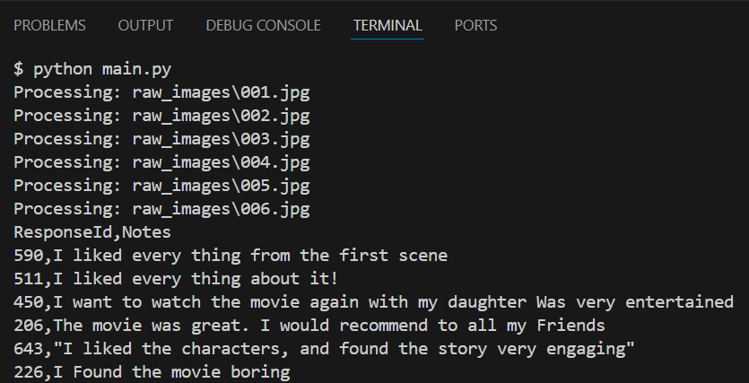

# Machine Learning on AWS – Exercises

This repository contains all practical exercises completed during the [Machine Learning on AWS](https://www.coursera.org/learn/machine-learning-on-aws/) course. Each exercise integrates AWS services using Python and the Boto3 SDK.

---

## AWS CLI (Command Line Interface) Setup

```bash
# Install the AWS CLI (Windows)
winget install --id Amazon.AWSCLI

# Configure your credentials
aws configure
```

Provide your AWS Access Key, Secret Access Key, default region (e.g. `us-west-2`), and output format (e.g. `json`).

---

## Exercise 1: Amazon Rekognition – Image Label Detection

This application analyzes `.jpeg` images (located in `public/photos/`) using Amazon Rekognition and generates a `data.json` file (saved in `build/data.json`) used by a web interface to filter and display labels.

### Technologies

- AWS Rekognition
- Boto3 (AWS SDK for Python)
- JSON processing
- Local HTTP server

### How It Works

1. The script `build_json.py` scans the `public/photos/` directory for JPEG images.
2. Each image is sent to Amazon Rekognition using `detect_labels`.
3. Detected labels and confidence scores are saved to `build/data.json`.
4. A local web interface (`build/index.html`) loads the JSON and displays images with their labels.

### Run Locally

```bash
# Install dependencies
pip install boto3

# Generate data.json using Rekognition
python build_json.py > build/data.json

# Launch local web server
python -m http.server 8080 -d build
```

Then open `http://localhost:8080` in your browser.

### Preview

The screenshot below shows the application running locally. On the left, images from `public/photos/` are displayed. When hovering over an image, the detected labels (returned by Amazon Rekognition) appear on the right panel.


---

## Exercise 2: Amazon Textract – Document Text Extraction

This application extracts structured text from handwritten forms using Amazon Textract and custom queries.

### Technologies

- AWS Textract
- Boto3 (Python SDK)
- Query-based document parsing
- CSV output

### How It Works

1. The script `main.py` scans all `.jpg` files in `raw_images/`.
2. It sends each image to Textract with two queries: `"What is the response id"` and `"What are the notes?"`.
3. The answers are extracted from `response["Blocks"]` and saved as rows.
4. The result is displayed in standard CSV format.

### Run Locally

```bash
# Execute the script
python main.py
```

### Preview

The screenshot below shows the terminal output, including extracted `ResponseId` and `Notes` fields from each handwritten review.



---

## Exercise 3: Amazon Comprehend – Sentiment Analysis

This application uses Amazon Comprehend to analyze the sentiment of each review in the `movies.csv` file generated in Exercise 2.

### Technologies

- AWS Comprehend
- Boto3 (AWS SDK for Python)
- Sentiment detection
- CSV parsing

### How It Works

1. The script `main.py` reads the `movies.csv` file.
2. It extracts the `Notes` column (the movie reviews).
3. It sends the list of reviews to `batch_detect_sentiment` from Amazon Comprehend.
4. The API returns a sentiment (e.g., POSITIVE, NEGATIVE) for each review.
5. The sentiment is displayed next to its corresponding review in the terminal.

### Run Locally

```bash
# Execute the script
python main.py
```

### Preview

The screenshot below shows the terminal output with sentiment detected for each review.


---

## Exercise 4: Amazon Transcribe & Translate – Audio Processing

This application transcribes speech from a Portuguese video and translates it into English, displaying dynamic subtitles below the video in a web interface.

### Technologies

- Amazon Transcribe
- Amazon Translate
- Boto3 (AWS SDK for Python)
- AWS CLI
- JSON handling
- Local HTTP server

### How It Works

1. The video `Raf01_320.mov` is uploaded to an S3 bucket.
2. A transcription job is launched using Amazon Transcribe via the AWS CLI.
3. The generated transcript is saved to `transcribe.json`.
4. The Python script `transcribe_translate.py` uses Amazon Translate to convert each sentence into English.
5. Translated sentences are matched with their start time and saved to `translated.json`.
6. The web interface (`index.html`) synchronizes the original transcript and its translation below the video.

### Run Locally

```bash
# Start the local server
python -m http.server 8080
```

Then open [http://localhost:8080](http://localhost:8080) in your browser.

### Preview

The screenshot below shows the video player with dynamic subtitles generated by Amazon Transcribe (left) and their translation via Amazon Translate (right).


---

## Exercise 5: Amazon Lex & Lambda – Chatbot for Store Hours

This application builds a conversational chatbot using Amazon Lex and a Lambda function for fulfillment. The chatbot answers customer questions about store opening hours based on date and location.

### Technologies

- Amazon Lex
- AWS Lambda (Python 3.9)
- Slot types & Intents
- AWS Console

### How It Works

1. A Lex bot named `CustomerService` is created with the intent `StoreHours`.
2. Two slots are defined:
   - `StoreLocation` (custom type with values: Seattle, Redmond, Kirkland)
   - `Date` (built-in type: `AMAZON.Date`)
3. Sample utterances help Lex understand common user questions like:
   - “What time do you open?”
   - “What time does the Seattle store open tomorrow?”
4. A Lambda function named `LexFunction` processes the slot inputs and returns the corresponding opening hour based on a predefined schedule.
5. The Lambda is linked to the bot alias, enabling dynamic response generation.

### Run & Test

Once the bot is built and deployed:

- Use the **Test window in the Amazon Lex console**.
- Try questions like:
  - `What time do you open?`
  - `What time does the Kirkland store open on Friday?`
  - `At what time does the Redmond store open this Wednesday?`

### Preview

The screenshot below shows a successful interaction with the bot, where Lex collects the `Date` and `StoreLocation` slots and triggers the Lambda function, which returns the correct store opening hour.


---

## Requirements

- Python 3.x  
- AWS CLI configured (`aws configure`)  
- AWS account
